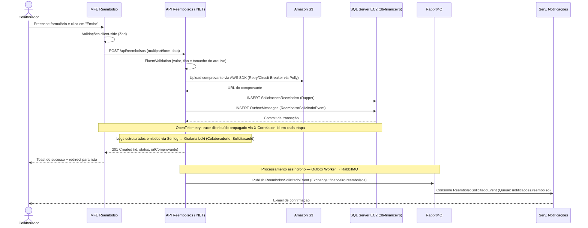
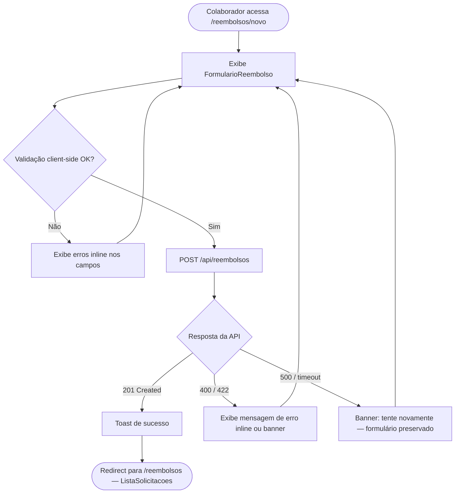
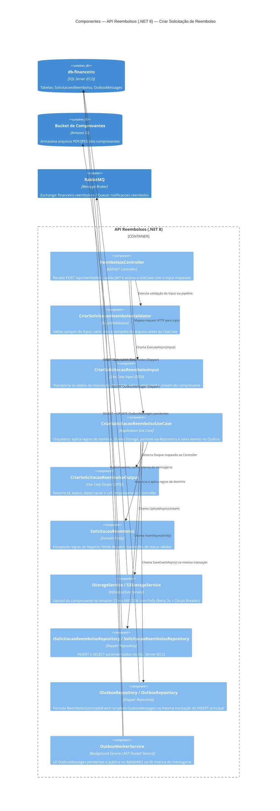
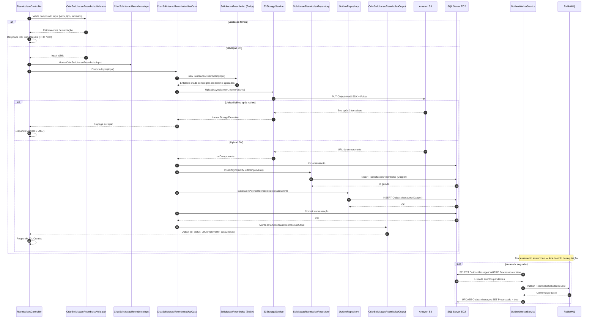

# REFINAMENTO — EXEMPLO DE REFERÊNCIA
> **História:** Solicitação de Reembolso de Despesas pelo Colaborador
> Este documento é um exemplo completo de como preencher todos os artefatos de refinamento.

---

## 📑 ÍNDICE

**Checklist de Refinamento**
- [Gate 0 — Critérios de Entrada](#-gate-0--critérios-de-entrada)
- [Gate 1 — Refinamento Funcional e de Negócio](#-gate-1--refinamento-funcional-e-de-negócio)
  - [1.1 Contexto e Valor](#11-contexto-e-valor)
  - [1.2 Critérios de Aceite (BDD)](#12-critérios-de-aceite-bdd)
  - [1.3 Regras de Negócio e Interface](#13-regras-de-negócio-e-interface)
- [Gate 2 — Refinamento Técnico e Arquitetural](#-gate-2--refinamento-técnico-e-arquitetural)
  - [2.1 Análise de Impacto e Dependências](#21-análise-de-impacto-e-dependências)
  - [2.2 Front-end: Micro Frontend (ReactJS)](#22-front-end-micro-frontend-reactjs)
  - [2.3 Back-end: Microserviços (.NET 8/9)](#23-back-end-microserviços-net-89)
  - [2.4 Infraestrutura, Segurança e Observabilidade](#24-infraestrutura-segurança-e-observabilidade)
  - [2.5 Contratos e Modelagem](#25-contratos-e-modelagem)
- [Gate 3 — Fatiamento e Estimativa](#-gate-3--fatiamento-e-estimativa)
  - [3.1 Princípios INVEST](#31-princípios-invest)
  - [3.2 Fatiamento e Subtarefas](#32-fatiamento-e-subtarefas)
  - [3.3 Estimativa](#33-estimativa)
- [Gate 4 — Definition of Ready (DoR)](#-gate-4--definition-of-ready-dor--validação-final)
- [Definition of Done (DoD)](#-definition-of-done-dod--critérios-de-saída-da-sprint)

**História no Azure DevOps**
- [Descrição da História](#-descrição-da-história)
- [Rastreabilidade](#-rastreabilidade)
- [Critérios de Aceite (BDD)](#-critérios-de-aceite-bdd)
- [Subtarefas Técnicas de Engenharia](#️-subtarefas-técnicas-de-engenharia)
- [Artefatos Anexados](#-artefatos-anexados)

**Deliverables**
- [🔵 Geral](#-geral)
  - [1. História Detalhada](#1-história-detalhada)
  - [2. Critérios de Aceite (BDD)](#2-critérios-de-aceite-bdd)
  - [3. Diagrama de Sequência](#3-diagrama-de-sequência)
  - [4. Lista de Subtarefas](#4-lista-de-subtarefas)
  - [5. Estimativa de Complexidade](#5-estimativa-de-complexidade)
- [🟢 Frontend — Micro Frontend (ReactJS)](#-frontend--micro-frontend-reactjs)
  - [6. Especificação de Componentes](#6-especificação-de-componentes)
  - [7. Mapeamento de Estados da UI](#7-mapeamento-de-estados-da-ui)
  - [8. Contrato de Integração MFE (Module Federation)](#8-contrato-de-integração-mfe-module-federation)
  - [9. Dependências Compartilhadas](#9-dependências-compartilhadas)
  - [10. Fluxo de Navegação](#10-fluxo-de-navegação)
  - [11. Estratégia de Cache (React Query)](#11-estratégia-de-cache-react-query)
- [🟠 Backend — Microserviços (.NET 8/9)](#-backend--microserviços-net-89)
  - [12. Contrato de API](#12-contrato-de-api)
  - [13. Schema do Evento](#13-schema-do-evento)
  - [14. Script SQL](#14-script-sql)
  - [15. Diagrama de Componentes C4 — Clean Architecture](#15-diagrama-de-componentes-c4--clean-architecture-backend)
  - [16. Diagrama de Sequência — Fluxo Interno do Backend](#16-diagrama-de-sequência--fluxo-interno-do-backend-clean-architecture)

---

## ✅ GATE 0 — CRITÉRIOS DE ENTRADA

- [x] A história possui título descritivo e está linkada ao Épico correspondente.
- [x] A narrativa no formato **"Como / Quero / Para que"** está escrita.
- [x] O PO consegue explicar o valor de negócio da história em 2 frases.
- [x] Protótipos ou wireframes (Figma) estão disponíveis e linkados.
- [x] A história não depende de outra história não refinada ou não entregue.
- [x] O escopo está focado em **uma única entrega de valor** (não é um épico disfarçado).

---

## ✅ GATE 1 — REFINAMENTO FUNCIONAL E DE NEGÓCIO

### 1.1 Contexto e Valor
- [x] O time compreende o problema de negócio que a história resolve.
- [x] O usuário-alvo (persona) foi identificado.
- [x] O valor de negócio foi validado e é claro para todo o time.

> **Contexto registrado no refinamento:**
> Atualmente, colaboradores enviam pedidos de reembolso por e-mail com comprovantes em anexo, o que gera retrabalho manual para o financeiro e atrasa o pagamento em até 15 dias. A história entrega o fluxo de criação da solicitação — o colaborador preenche os dados, anexa o comprovante e submete. O financeiro recebe notificação automática para análise.
>
> **Métrica de sucesso:** reduzir o tempo médio entre a submissão da solicitação e o início da análise pelo financeiro de **15 dias para menos de 24 horas**. Medido pelo campo `DataCriacao` da solicitação vs. timestamp do primeiro acesso do analista financeiro na sprint de validação.
>
> **Financeiro responsável pela análise:** grupo `Analistas Financeiros` — usuários com role `financeiro.analista` no JWT. A notificação é enviada para a fila de e-mail do grupo, não para um usuário específico. Definição validada com Ana Beatriz (PO) em 10/09/2026.

> **Persona identificada:**
> **Colaborador CLT interno** — funcionário da empresa com acesso ao sistema corporativo via SSO. Pode ser de qualquer departamento. O limite de R$ 5.000,00 se aplica a todos os colaboradores CLT; regras diferenciadas para outros vínculos (PJ, estagiário) são fora do escopo desta história e serão tratadas em história futura.

### 1.2 Critérios de Aceite (BDD)
- [x] Os cenários BDD cobrem o **fluxo principal (happy path)**.
- [x] Os cenários BDD cobrem os principais **fluxos de exceção e erro de negócio**.
- [x] Os critérios de aceite são objetivos, mensuráveis e testáveis.
- [x] Não há critérios ambíguos ou sujeitos a interpretação dupla.

### 1.3 Regras de Negócio e Interface
- [x] Todas as regras de negócio relevantes estão documentadas na história.
- [x] Os protótipos de tela foram apresentados e validados pelo time.
- [x] Os **4 estados da UI** foram mapeados: Loading, Sucesso, Erro e Empty State.
- [x] Comportamento da UI em caso de falha de rede ou serviço indisponível está definido.

> **Regras de negócio registradas:**
> - Valor máximo por solicitação: R$ 5.000,00.
> - Apenas arquivos PDF ou JPEG são aceitos como comprovante (máx. 5 MB).
> - Uma solicitação só pode ser submetida se todos os campos obrigatórios estiverem preenchidos.
> - Após a submissão, o status da solicitação passa para `AGUARDANDO_ANALISE` e não pode ser editada.
> - O colaborador só pode visualizar suas próprias solicitações.

---

## ✅ GATE 2 — REFINAMENTO TÉCNICO E ARQUITETURAL

### 2.1 Análise de Impacto e Dependências
- [x] Impacto na arquitetura atual foi analisado.
- [x] Dependências com outros times, squads ou serviços foram mapeadas.
- [x] Dependências externas (APIs de terceiros, parceiros) foram identificadas e validadas.

> **Dependências identificadas:**
> - `MFE Shell` (autenticação via token JWT já existente).
> - `Serviço de Notificações` (squad Plataforma) — event-driven via RabbitMQ; contrato de evento já definido.
> - `Serviço de Storage` (Amazon S3) — AWS SDK já disponível na solução.
> - Banco de dados `db-financeiro` (SQL Server rodando em EC2) — acesso via Dapper, repositório já existente na solution.
> - Banco de dados `db-relatorios` (PostgreSQL no Amazon RDS) — apenas leitura, fora do escopo desta história.

### 2.2 Front-end: Micro Frontend (ReactJS)

| Categoria | Item de Verificação | Status |
| :--- | :--- | :---: |
| **Arquitetura MFE** | MFE `mf-reembolso` exposto via Module Federation para o Shell `financeiro-shell`. | [x] |
| **Module Federation** | `React`, `ReactDOM` e `React-Query` configurados como `singleton` no `webpack.config.js`. | [x] |
| **Fallback & Isolation** | `<ErrorBoundary>` envolvendo o `mf-reembolso` no Shell para isolar falhas. | [x] |
| **Estados de UI** | Loading (skeleton), Sucesso (toast + redirect), Erro (inline com mensagem da API), Empty State (lista vazia). | [x] |
| **State & Cache** | `useMutation` do React Query para submissão; `staleTime: 0` para garantir dados frescos após submit. | [x] |
| **Segurança & Token** | Token JWT injetado via Axios interceptor do Shell; renovação silenciosa via refresh token já implementada. | [x] |

### 2.3 Back-end: Microserviços (.NET 8/9)

| Categoria | Item de Verificação | Status |
| :--- | :--- | :---: |
| **Arquitetura** | `CriarSolicitacaoReembolsoUseCase` com `CriarSolicitacaoReembolsoInput` e `CriarSolicitacaoReembolsoOutput`. Clean Architecture com separação `Application / Domain / Infrastructure`. | [x] |
| **Validação** | `CriarSolicitacaoReembolsoValidator` com FluentValidation: valor > 0, valor ≤ 5000, tipo de arquivo permitido, tamanho ≤ 5MB. | [x] |
| **Erros** | `ProblemDetailsMiddleware` retornando RFC 7807 para erros de validação (400) e regra de negócio (422). | [x] |
| **Persistência** | Script SQL com `CREATE TABLE SolicitacoesReembolso` com índice em `ColaboradorId` e `Status`. Queries Dapper parametrizadas no `SolicitacaoReembolsoRepository`. | [x] |
| **Performance BD** | `QueryFirstOrDefaultAsync` para busca por ID. Sem N+1 — lista paginada com query única via `QueryAsync`. | [x] |
| **Mensageria** | `ReembolsoSolicitadoEvent` publicado via lib interna de mensageria com Outbox Pattern (tabela `OutboxMessages`). Consumidor no serviço de notificações é idempotente via `CorrelationId`. | [x] |
| **Resiliência** | Polly configurado: Retry 3x com Exponential Backoff para chamadas ao Amazon S3; Circuit Breaker após 5 falhas consecutivas. | [x] |
| **Cache** | Redis (self-hosted no EC2) não aplicável neste fluxo de escrita. Leitura de configurações (limites de valor/tamanho) em `IMemoryCache` com TTL de 1h. | [x] |

### 2.4 Infraestrutura, Segurança e Observabilidade

| Categoria | Item de Verificação | Status |
| :--- | :--- | :---: |
| **Observabilidade** | `CorrelationId` propagado via header `X-Correlation-Id` em todas as chamadas HTTP e nos headers da mensagem RabbitMQ. Traces distribuídos via OpenTelemetry (OTLP → Grafana Tempo). | [x] |
| **Logging** | Serilog com sink no Grafana Loki (via OpenTelemetry Exporter). Campos `ColaboradorId` e `SolicitacaoId` logados como atributos estruturados; valor financeiro não é logado (PII/sensível). | [x] |
| **Health Check** | `/healthz/live` e `/healthz/ready` já existentes no serviço; adicionado check para Amazon S3, SQL Server (EC2) e RabbitMQ no `/healthz/ready`. | [x] |
| **Containerization** | Dockerfile Multi-stage já existente no serviço; imagem executa como usuário `app` (não-root). Push para Amazon ECR via pipeline do Azure DevOps. Nenhuma alteração estrutural necessária. | [x] |
| **Segurança** | CORS restrito à origem `https://financeiro.empresa.com.br`. Claim `colaborador_id` extraída e validada do JWT para escopo de dados. | [x] |

### 2.5 Contratos e Modelagem
- [x] Contrato de API (REST/JSON) definido e documentado.
- [x] Schema do evento de integração definido.
- [x] Modelagem de dados revisada e scripts SQL validados.
- [x] Queries Dapper críticas revisadas quanto a parâmetros e performance.
- [x] Estratégia de cache definida (IMemoryCache para configurações).

---

## ✅ GATE 3 — FATIAMENTO E ESTIMATIVA

### 3.1 Princípios INVEST
- [x] **I**ndependente — não bloqueia nem é bloqueada por outras histórias da sprint.
- [x] **N**egociável — o upload de comprovante pode ser entregue em história separada se necessário.
- [x] **V**aliosa — elimina processo manual do financeiro e dá visibilidade ao colaborador.
- [x] **E**stimável — escopo claro, contratos definidos, sem incertezas técnicas.
- [x] **S**mall — estimada em 12 SP brutos no refinamento; após Planning Poker o time acordou em **8 SP**, cabe na Sprint de 2 semanas.
- [x] **T**estável — critérios BDD objetivos cobrem happy path e exceções.

### 3.2 Fatiamento e Subtarefas
- [x] A história foi fatiada em subtarefas técnicas claras e atribuíveis.
- [x] Cada subtarefa tem responsável definido.
- [x] Nenhuma subtarefa isolada é maior do que 2 dias de trabalho.

### 3.3 Estimativa
- [x] Estimativa de esforço realizada via Planning Poker: **8 Story Points**.
- [x] O time está confortável com a estimativa (sem objeções não resolvidas).

---

## ✅ GATE 4 — DEFINITION OF READY (DoR) — VALIDAÇÃO FINAL

- [x] A narrativa "Como / Quero / Para que" está escrita e validada pelo PO.
- [x] Os Critérios de Aceite em formato BDD estão completos e sem ambiguidade.
- [x] Os protótipos de tela estão aprovados e linkados na tarefa.
- [x] Os contratos de API / schemas de eventos estão definidos.
- [x] As dependências externas estão mapeadas e não bloqueiam o desenvolvimento.
- [x] As subtarefas técnicas estão criadas no board (Azure DevOps).
- [x] A estimativa de Story Points foi atribuída.
- [x] O checklist técnico (Gates 2.2, 2.3 e 2.4) foi revisado pelo time de engenharia.
- [x] Não há dúvidas em aberto sem responsável e prazo para resolução.

> ⚠️ **Dúvida registrada — pendente de resposta do PO:**
> O colaborador pode **cancelar** uma solicitação com status `AGUARDANDO_ANALISE`? Se sim, qual o novo status e há notificação para o financeiro? Prazo para resposta: **antes da Sprint Planning**. Responsável: Ana Beatriz (PO).

---

## ✅ DEFINITION OF DONE (DoD) — CRITÉRIOS DE SAÍDA DA SPRINT

> A história só é considerada **concluída** se **todos** os itens abaixo estiverem satisfeitos.

### Funcional
- [ ] Todos os cenários BDD (1 a 7) passam nos testes de integração.
- [ ] Comportamento validado em ambiente de **staging** pelo PO e pelo TL.
- [ ] Protótipo do Figma bate com a implementação real (estados Loading, Sucesso, Erro e Empty State).

### Qualidade e Testes
- [ ] Cobertura de testes de integração ≥ 80% nos UseCases (`Criar`, `Listar`, `ObterPorId`).
- [ ] Nenhum erro ou warning novo introduzido no pipeline de lint/build.
- [ ] Testes de integração com Testcontainers passando no pipeline CI do Azure DevOps.

### Segurança e Observabilidade
- [ ] `CorrelationId` presente em todos os logs e traces da operação.
- [ ] Valor financeiro **não aparece** em nenhum log (validado via Grafana Loki em staging).
- [ ] Health check `/healthz/ready` verde com S3, SQL Server e RabbitMQ em staging.

### Entrega e Deploy
- [ ] Imagem publicada no Amazon ECR com tag de versão semântica.
- [ ] Deploy realizado no ambiente de **staging** via pipeline Azure DevOps sem erros.
- [ ] `mf-reembolso` carregando corretamente no `financeiro-shell` em staging (sem erro de Module Federation).

### Documentação
- [ ] Script SQL `V001` e `V002` aplicados no banco de staging.
- [ ] Artefatos do refinamento atualizados caso haja mudança de escopo durante a sprint.

---

## 📋 HISTÓRIA NO AZURE DEVOPS

### 📝 Descrição da História
**Como** colaborador da empresa
**Quero** criar uma solicitação de reembolso informando valor, categoria e anexando o comprovante
**Para que** eu possa acompanhar o status do meu pedido e o financeiro seja notificado automaticamente sem necessidade de e-mails

---

### 🔗 Rastreabilidade
- **Épico:** [EPIC-042 — Módulo de Gestão de Despesas](https://dev.azure.com/empresa/projeto/_boards/epic/42)
- **Squad responsável:** Squad Financeiro
- **Data do refinamento:** 10/09/2026
- **Refinamento aprovado por:** Ana Beatriz (PO)

---

### 🎯 Critérios de Aceite (BDD)

**Cenário 1: Submissão com sucesso — perspectiva do colaborador**
- **Dado que** o colaborador CLT está autenticado e acessa o formulário de reembolso
- **Quando** preenche todos os campos obrigatórios (descrição, valor R$ 350,00, categoria "Alimentação") e anexa um PDF de 1,2 MB
- **Então** a solicitação é criada com status `AGUARDANDO_ANALISE`, o colaborador vê uma mensagem de sucesso e é redirecionado para a lista de solicitações

**Cenário 1b: Submissão com sucesso — perspectiva do financeiro**
- **Dado que** uma solicitação foi submetida com sucesso pelo colaborador
- **Quando** o evento `ReembolsoSolicitadoEvent` é processado pelo Serviço de Notificações
- **Então** o grupo `Analistas Financeiros` recebe um e-mail com os dados da solicitação (colaborador, valor, categoria e link para análise) em até 5 minutos após a submissão

**Cenário 2: Valor acima do limite permitido**
- **Dado que** o colaborador está autenticado e acessa o formulário de reembolso
- **Quando** informa um valor de R$ 6.000,00
- **Então** o sistema exibe erro de validação inline "O valor máximo por solicitação é R$ 5.000,00" e não submete o formulário

**Cenário 3: Arquivo com formato inválido**
- **Dado que** o colaborador está autenticado e acessa o formulário de reembolso
- **Quando** tenta anexar um arquivo `.docx`
- **Então** o sistema exibe o erro "Apenas arquivos PDF ou JPEG são aceitos" e bloqueia o upload

**Cenário 4: Arquivo acima do tamanho máximo**
- **Dado que** o colaborador está autenticado e acessa o formulário de reembolso
- **Quando** tenta anexar um arquivo JPEG de 8 MB
- **Então** o sistema exibe o erro "O arquivo não pode ultrapassar 5 MB" e bloqueia o upload

**Cenário 5: Falha de serviço durante a submissão**
- **Dado que** o colaborador preencheu o formulário corretamente e clicou em "Enviar"
- **Quando** o serviço de back-end retorna erro 500
- **Então** o sistema exibe a mensagem "Não foi possível enviar sua solicitação. Tente novamente em instantes." sem perder os dados do formulário

**Cenário 6: Solicitação já submetida não pode ser editada**
- **Dado que** uma solicitação com status `AGUARDANDO_ANALISE` já existe
- **Quando** o colaborador tenta acessar o formulário de edição dessa solicitação
- **Então** o sistema exibe mensagem "Esta solicitação não pode ser editada" e redireciona para a visualização

**Cenário 7: Colaborador acessa a lista sem solicitações anteriores**
- **Dado que** o colaborador CLT está autenticado e nunca criou uma solicitação de reembolso
- **Quando** acessa a tela de listagem `/reembolsos`
- **Então** o sistema exibe o estado vazio com a mensagem "Você ainda não possui solicitações." e um botão de ação "Criar solicitação" visível

---

### 🛠️ Subtarefas Técnicas de Engenharia

- [ ] **[MFE React]** Criar componente `FormularioReembolso` com campos: descrição, valor, categoria (select), upload de comprovante e botão de submit — incluindo estados de Loading (skeleton), Sucesso (toast) e Erro (inline).
- [ ] **[MFE React]** Implementar validações client-side (valor ≤ 5000, tipo e tamanho do arquivo) com React Hook Form + Zod antes de chamar a API.
- [ ] **[MFE React]** Configurar `useMutation` do React Query para `POST /api/reembolsos`; em caso de sucesso, invalidar query da lista de solicitações e redirecionar.
- [ ] **[MFE React]** Configurar `<ErrorBoundary>` no Shell para o `mf-reembolso` e validar comportamento de fallback quando o MFE não carregar.
- [ ] **[MFE React]** Configurar o `remotes` no `webpack.config.js` do `financeiro-shell` apontando para o `remoteEntry.js` do `mf-reembolso` (URL por ambiente: dev/staging/prod).
- [ ] **[.NET API]** Criar `CriarSolicitacaoReembolsoUseCase`, `CriarSolicitacaoReembolsoInput`, `CriarSolicitacaoReembolsoOutput` e `CriarSolicitacaoReembolsoValidator` (FluentValidation).
- [ ] **[.NET API]** Criar `ListarSolicitacoesUseCase` com `ListarSolicitacoesInput` (page, pageSize, statusFiltro) e `ListarSolicitacoesOutput` (envelope paginado).
- [ ] **[.NET API]** Criar `ObterSolicitacaoPorIdUseCase` com `ObterSolicitacaoPorIdInput` (id) e `ObterSolicitacaoPorIdOutput`; validar que `ColaboradorId` do JWT corresponde ao dono da solicitação.
- [ ] **[.NET API]** Criar `SolicitacaoReembolsoRepository` com Dapper: métodos `InsertAsync`, `GetByIdAsync` e `GetPagedByColaboradorAsync` (listagem paginada com filtro opcional de status).
- [ ] **[.NET API]** Implementar upload do comprovante para Amazon S3 via AWS SDK com Polly (Retry 3x + Circuit Breaker).
- [ ] **[.NET API]** Publicar evento `ReembolsoSolicitadoEvent` via lib interna de mensageria com Outbox Pattern após persistência bem-sucedida.
- [ ] **[.NET API]** Configurar OpenTelemetry no .NET: exportar traces (OTLP → Grafana Tempo) e logs estruturados (Serilog → Grafana Loki); instrumentar HTTP, Dapper e lib interna de mensageria.
- [ ] **[.NET API]** Criar script SQL `V001__create_solicitacoes_reembolso.sql` com a tabela, índices e constraint de status.
- [ ] **[.NET API]** Criar script SQL `V002__create_outbox_messages.sql` com a tabela `OutboxMessages`, índice filtrado em `Processado = 0`.
- [ ] **[DevOps/QA]** Criar testes de integração com Testcontainers (SQL Server + RabbitMQ + LocalStack para S3) cobrindo os cenários BDD 1 a 7.
- [ ] **[DevOps/QA]** Validar pipeline CI no Azure DevOps Pipelines: build, testes, push da imagem para Amazon ECR e deploy no Amazon ECS.

---

### 📎 Artefatos Anexados

**Geral**
- [x] [Diagrama de Sequência — Fluxo de Criação](#3-diagrama-de-sequência)

**Frontend**
- [x] [Protótipo no Figma — Tela de Solicitação de Reembolso](https://figma.com/file/exemplo)
- [x] [Especificação de Componentes](#6-especificação-de-componentes)
- [x] [Mapeamento de Estados da UI](#7-mapeamento-de-estados-da-ui)
- [x] [Contrato de Integração MFE (Module Federation)](#8-contrato-de-integração-mfe-module-federation)
- [x] [Fluxo de Navegação](#10-fluxo-de-navegação)
- [x] [Estratégia de Cache React Query](#11-estratégia-de-cache-react-query)

**Backend**
- [x] [Especificação de Contrato de API (payload JSON)](#12-contrato-de-api)
- [x] [Schema do Evento ReembolsoSolicitadoEvent](#13-schema-do-evento)
- [x] [Script SQL V001](#14-script-sql)
- [x] [Diagrama de Componentes C4 — Clean Architecture](#15-diagrama-de-componentes-c4--clean-architecture-backend)
- [x] [Diagrama de Sequência — Fluxo Interno do Backend](#16-diagrama-de-sequência--fluxo-interno-do-backend-clean-architecture)

---

## 📦 DELIVERABLES DO REFINAMENTO

---

### 🔵 Geral

#### 1. História Detalhada

**Como** colaborador da empresa
**Quero** criar uma solicitação de reembolso informando valor, categoria e anexando o comprovante
**Para que** eu possa acompanhar o status do meu pedido e o financeiro seja notificado automaticamente

#### 2. Critérios de Aceite (BDD)

*(Detalhados na seção da história acima — 7 cenários + 1 sub-cenário cobrindo happy path, perspectiva do financeiro, validações, falha de serviço e empty state.)*

#### 3. Diagrama de Sequência



#### 4. Lista de Subtarefas

*(Detalhadas na seção da história acima — 13 subtarefas distribuídas entre Frontend, Backend e DevOps/QA.)*

#### 5. Estimativa de Complexidade

| Subtarefa | Responsável | Story Points |
| :--- | :--- | :---: |
| Componente UI `FormularioReembolso` + validações client-side (Zod) | Frontend | 2 |
| React Query `useMutation` + cache invalidation + `ErrorBoundary` | Frontend | 1 |
| Configuração Module Federation `mf-reembolso` + `financeiro-shell` remotes | Frontend | 1 |
| `CriarSolicitacaoReembolsoUseCase` + Input + Output + Validator (.NET) | Backend | 2 |
| `SolicitacaoReembolsoRepository` Dapper + Script SQL | Backend | 1 |
| Upload Amazon S3 (AWS SDK) + Polly | Backend | 1 |
| Outbox Pattern + publicação RabbitMQ via lib interna | Backend | 1 |
| OpenTelemetry (.NET): traces OTLP → Grafana Tempo + Serilog → Loki | Backend | 1 |
| Testes de integração Testcontainers + LocalStack + pipeline CI/CD (ECR + ECS) | QA / DevOps | 2 |
| **Total** | | **12 SP** |

> ⚠️ Após Planning Poker, o time acordou em **8 Story Points** agrupando itens de menor complexidade e desconsiderando overhead do pipeline CI já existente.

---

### 🟢 Frontend — Micro Frontend (ReactJS)

#### 6. Especificação de Componentes

| Componente | Responsabilidade | Props de Entrada | Eventos Emitidos |
| :--- | :--- | :--- | :--- |
| `FormularioReembolso` | Renderiza o formulário completo de criação, gerencia estado local e chama a mutation | `categorias: Categoria[]` | `onSuccess(solicitacaoId: string)` |
| `UploadComprovante` | Campo de upload com validação de tipo e tamanho antes do envio | `maxSizeMB: number`, `accept: string[]`, `onChange: (file) => void` | `onValidationError(mensagem: string)` |
| `StatusBadge` | Exibe o badge visual do status da solicitação | `status: 'AGUARDANDO_ANALISE' \| 'APROVADA' \| 'REJEITADA' \| 'CANCELADA'` | — |
| `ListaSolicitacoes` | Lista paginada das solicitações do colaborador autenticado | `page?: number`, `pageSize?: number`, `statusFiltro?: string` — colaboradorId lido do contexto de autenticação do Shell | `onSolicitacaoClick(id: string)` |

#### 7. Mapeamento de Estados da UI

| Tela / Componente | Loading | Sucesso | Erro | Empty State |
| :--- | :--- | :--- | :--- | :--- |
| `FormularioReembolso` | Skeleton nos campos + botão "Enviando…" desabilitado | Toast "Solicitação enviada com sucesso!" + redirect para lista | Mensagem inline abaixo do campo ou banner de erro genérico | — |
| `UploadComprovante` | Barra de progresso do upload | Ícone de check + nome do arquivo | Mensagem inline "Apenas PDF ou JPEG, máx. 5 MB" | Área de drop com texto "Arraste o comprovante aqui" |
| `ListaSolicitacoes` | Skeleton de 3 linhas | Tabela com as solicitações | Banner "Não foi possível carregar as solicitações. Tente novamente." | Mensagem "Você ainda não possui solicitações." |

#### 8. Contrato de Integração MFE (Module Federation)

```js
// webpack.config.js — mf-reembolso
new ModuleFederationPlugin({
  name: 'mfReembolso',
  filename: 'remoteEntry.js',
  exposes: {
    './FormularioReembolso': './src/components/FormularioReembolso',
    './ListaSolicitacoes':   './src/components/ListaSolicitacoes',
  },
  shared: {
    react:            { singleton: true, requiredVersion: '^18.0.0' },
    'react-dom':      { singleton: true, requiredVersion: '^18.0.0' },
    '@tanstack/react-query': { singleton: true, requiredVersion: '^5.0.0' },
    'react-router-dom':      { singleton: true, requiredVersion: '^6.0.0' },
  },
})
```

**Consumo no Shell (`financeiro-shell`):**
```tsx
const FormularioReembolso = React.lazy(
  () => import('mfReembolso/FormularioReembolso')
);

// Props esperadas pelo Shell ao montar o remote:
// <FormularioReembolso categorias={categorias} onSuccess={(id) => navigate(`/reembolsos/${id}`)} />
```

**Configuração do Shell (`financeiro-shell`) — `webpack.config.js`:**
```js
new ModuleFederationPlugin({
  name: 'financeiroShell',
  remotes: {
    // URL varia por ambiente — injetada via variável de ambiente no build
    mfReembolso: `mfReembolso@${process.env.MF_REEMBOLSO_URL}/remoteEntry.js`,
  },
  shared: {
    react:            { singleton: true, requiredVersion: '^18.0.0' },
    'react-dom':      { singleton: true, requiredVersion: '^18.0.0' },
    '@tanstack/react-query': { singleton: true, requiredVersion: '^5.0.0' },
    'react-router-dom':      { singleton: true, requiredVersion: '^6.0.0' },
  },
})

// Variáveis de ambiente por pipeline (Azure DevOps Pipelines):
// dev:     MF_REEMBOLSO_URL=https://mf-reembolso.dev.empresa.com.br
// staging: MF_REEMBOLSO_URL=https://mf-reembolso.staging.empresa.com.br
// prod:    MF_REEMBOLSO_URL=https://mf-reembolso.empresa.com.br
// Imagem publicada no Amazon ECR e deploy via Amazon ECS (Fargate)
```

#### 9. Dependências Compartilhadas

| Lib | Versão mínima | Motivo do singleton |
| :--- | :--- | :--- |
| `react` | `^18.0.0` | Contexto único de hooks |
| `react-dom` | `^18.0.0` | Única raiz de renderização |
| `@tanstack/react-query` | `^5.0.0` | Cache compartilhado via `QueryClient` do Shell |
| `react-router-dom` | `^6.0.0` | Roteador único gerenciado pelo Shell |

#### 10. Fluxo de Navegação



#### 11. Estratégia de Cache (React Query)

| Query / Mutation | Chave (`queryKey`) | `staleTime` | `gcTime` | Política de atualização |
| :--- | :--- | :--- | :--- | :--- |
| Lista de solicitações | `['reembolsos', colaboradorId]` | `0` | `5 min` | `invalidateQueries` após mutação bem-sucedida |
| Categorias de reembolso | `['categorias-reembolso']` | `1 h` | `2 h` | Dados estáticos, sem invalidação ativa |
| Criação de solicitação | `useMutation` | — | — | Sem optimistic update; invalida `['reembolsos', colaboradorId]` no `onSuccess` |

---

### 🟠 Backend — Microserviços (.NET 8/9)

#### 12. Contrato de API

---

**`POST /api/reembolsos`** — Criar solicitação

Request (`multipart/form-data`):
```
descricao:   "Almoço com cliente - SP"   (string, obrigatório, max 255 chars)
valor:       350.00                       (decimal, obrigatório, > 0 e ≤ 5000)
categoriaId: 3                            (int, obrigatório)
comprovante: <arquivo PDF/JPEG, ≤ 5MB>   (file, obrigatório)
```

Response `201 Created`:
```json
{
  "id": "a1b2c3d4-e5f6-7890-abcd-ef1234567890",
  "status": "AGUARDANDO_ANALISE",
  "dataCriacao": "2026-09-10T14:32:00Z",
  "valor": 350.00,
  "descricao": "Almoço com cliente - SP",
  "categoria": "Alimentação",
  "comprovante": {
    "nomeArquivo": "nota_fiscal.pdf",
    "urlDownload": "https://s3.amazonaws.com/empresa-reembolsos/a1b2c3d4.pdf"
  }
}
```

Response `400 Bad Request` (validação):
```json
{
  "type": "https://tools.ietf.org/html/rfc7807",
  "title": "Requisição inválida",
  "status": 400,
  "errors": {
    "valor": ["O valor máximo por solicitação é R$ 5.000,00."],
    "comprovante": ["Apenas arquivos PDF ou JPEG são aceitos."]
  }
}
```

Response `401 Unauthorized` (token ausente ou inválido):
```json
{
  "type": "https://tools.ietf.org/html/rfc7807",
  "title": "Não autorizado",
  "status": 401,
  "detail": "Token de autenticação ausente ou inválido."
}
```

Response `422 Unprocessable Entity` (regra de negócio):
```json
{
  "type": "https://tools.ietf.org/html/rfc7807",
  "title": "Regra de negócio violada",
  "status": 422,
  "detail": "Esta solicitação não pode ser editada pois já foi submetida."
}
```

---

**`GET /api/reembolsos`** — Listar solicitações do colaborador autenticado (paginada)

Query params:
```
page:     1        (int, opcional, default: 1)
pageSize: 10       (int, opcional, default: 10, máx: 50)
status:   "AGUARDANDO_ANALISE"  (string, opcional, filtro por status)
```

Response `200 OK`:
```json
{
  "page": 1,
  "pageSize": 10,
  "totalItems": 23,
  "totalPages": 3,
  "items": [
    {
      "id": "a1b2c3d4-e5f6-7890-abcd-ef1234567890",
      "descricao": "Almoço com cliente - SP",
      "valor": 350.00,
      "categoria": "Alimentação",
      "status": "AGUARDANDO_ANALISE",
      "dataCriacao": "2026-09-10T14:32:00Z"
    }
  ]
}
```

Response `200 OK` (sem resultados):
```json
{
  "page": 1,
  "pageSize": 10,
  "totalItems": 0,
  "totalPages": 0,
  "items": []
}
```

Response `401 Unauthorized` (token ausente ou inválido):
```json
{
  "type": "https://tools.ietf.org/html/rfc7807",
  "title": "Não autorizado",
  "status": 401,
  "detail": "Token de autenticação ausente ou inválido."
}
```

---

**`GET /api/reembolsos/{id}`** — Buscar solicitação por ID

Path param:
```
id: "a1b2c3d4-e5f6-7890-abcd-ef1234567890"  (GUID, obrigatório)
```

Response `200 OK`:
```json
{
  "id": "a1b2c3d4-e5f6-7890-abcd-ef1234567890",
  "status": "AGUARDANDO_ANALISE",
  "dataCriacao": "2026-09-10T14:32:00Z",
  "valor": 350.00,
  "descricao": "Almoço com cliente - SP",
  "categoria": "Alimentação",
  "comprovante": {
    "nomeArquivo": "nota_fiscal.pdf",
    "urlDownload": "https://s3.amazonaws.com/empresa-reembolsos/a1b2c3d4.pdf"
  }
}
```

Response `403 Forbidden` (colaborador tentando acessar solicitação de outro):
```json
{
  "type": "https://tools.ietf.org/html/rfc7807",
  "title": "Acesso negado",
  "status": 403,
  "detail": "Você não tem permissão para acessar esta solicitação."
}
```

Response `401 Unauthorized` (token ausente ou inválido):
```json
{
  "type": "https://tools.ietf.org/html/rfc7807",
  "title": "Não autorizado",
  "status": 401,
  "detail": "Token de autenticação ausente ou inválido."
}
```

Response `404 Not Found`:
```json
{
  "type": "https://tools.ietf.org/html/rfc7807",
  "title": "Recurso não encontrado",
  "status": 404,
  "detail": "Solicitação não encontrada."
}
```

#### 13. Schema do Evento

**Evento:** `ReembolsoSolicitadoEvent`
**Exchange:** `financeiro.reembolsos` (type: `topic`)
**Routing Key:** `reembolso.solicitado`
**Queue (consumidor — Serv. Notificações):** `notificacoes.reembolso`

```json
{
  "correlationId": "a1b2c3d4-e5f6-7890-abcd-ef1234567890",
  "occurredAt": "2026-09-10T14:32:00Z",
  "payload": {
    "solicitacaoId": "a1b2c3d4-e5f6-7890-abcd-ef1234567890",
    "colaboradorId": "c9d8e7f6-1234-5678-abcd-000000000001",
    "colaboradorNome": "Carlos Souza",
    "colaboradorEmail": "carlos.souza@empresa.com.br",
    "valor": 350.00,
    "categoria": "Alimentação",
    "dataSolicitacao": "2026-09-10T14:32:00Z"
  }
}
```

#### 14. Script SQL

```sql
-- V001__create_solicitacoes_reembolso.sql
CREATE TABLE [dbo].[SolicitacoesReembolso] (
    [Id]              UNIQUEIDENTIFIER  NOT NULL DEFAULT NEWSEQUENTIALID(),
    [ColaboradorId]   UNIQUEIDENTIFIER  NOT NULL,
    [CategoriaId]     INT               NOT NULL,
    [Descricao]       NVARCHAR(255)     NOT NULL,
    [Valor]           DECIMAL(10, 2)    NOT NULL,
    [Status]          NVARCHAR(50)      NOT NULL DEFAULT 'AGUARDANDO_ANALISE',
    [UrlComprovante]  NVARCHAR(500)     NOT NULL,
    [DataCriacao]     DATETIME2         NOT NULL DEFAULT SYSUTCDATETIME(),
    [DataAtualizacao] DATETIME2         NULL,

    CONSTRAINT [PK_SolicitacoesReembolso]  PRIMARY KEY CLUSTERED ([Id]),
    CONSTRAINT [CK_Status] CHECK ([Status] IN (
        'AGUARDANDO_ANALISE', 'APROVADA', 'REJEITADA', 'CANCELADA'
    )),
    CONSTRAINT [CK_Valor_Positivo] CHECK ([Valor] > 0),
    CONSTRAINT [CK_Valor_Maximo]   CHECK ([Valor] <= 5000.00)
);

CREATE NONCLUSTERED INDEX [IX_SolicitacoesReembolso_ColaboradorId]
    ON [dbo].[SolicitacoesReembolso] ([ColaboradorId])
    INCLUDE ([Status], [DataCriacao]);

CREATE NONCLUSTERED INDEX [IX_SolicitacoesReembolso_Status]
    ON [dbo].[SolicitacoesReembolso] ([Status]);
```

```sql
-- V002__create_outbox_messages.sql
CREATE TABLE [dbo].[OutboxMessages] (
    [Id]           UNIQUEIDENTIFIER  NOT NULL DEFAULT NEWSEQUENTIALID(),
    [EventType]    NVARCHAR(255)     NOT NULL,
    [Payload]      NVARCHAR(MAX)     NOT NULL,
    [CorrelationId]UNIQUEIDENTIFIER  NOT NULL,
    [Processado]   BIT               NOT NULL DEFAULT 0,
    [DataCriacao]  DATETIME2         NOT NULL DEFAULT SYSUTCDATETIME(),
    [DataProcessamento] DATETIME2    NULL,

    CONSTRAINT [PK_OutboxMessages] PRIMARY KEY CLUSTERED ([Id])
);

CREATE NONCLUSTERED INDEX [IX_OutboxMessages_Processado_DataCriacao]
    ON [dbo].[OutboxMessages] ([Processado], [DataCriacao])
    WHERE [Processado] = 0;
```

#### 15. Diagrama de Componentes C4 — Clean Architecture (Backend)



#### 16. Diagrama de Sequência — Fluxo Interno do Backend (Clean Architecture)



